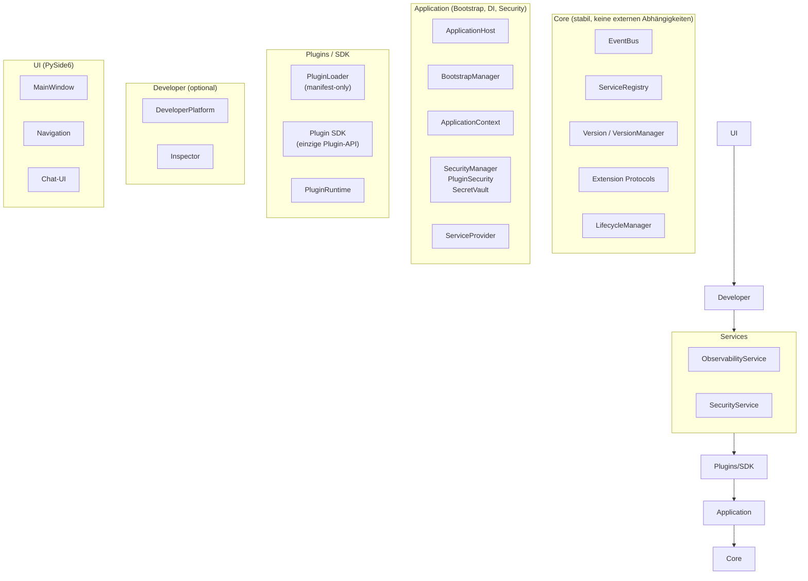
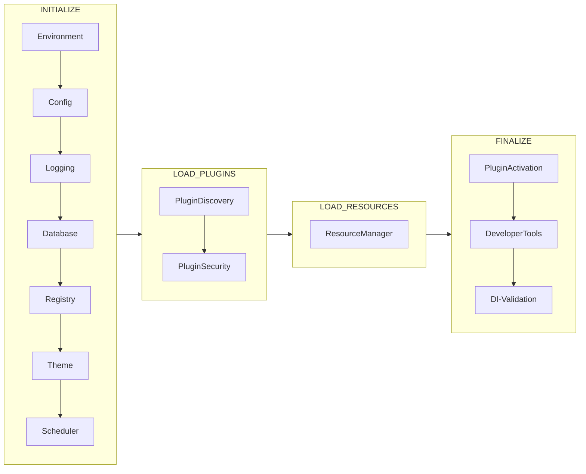
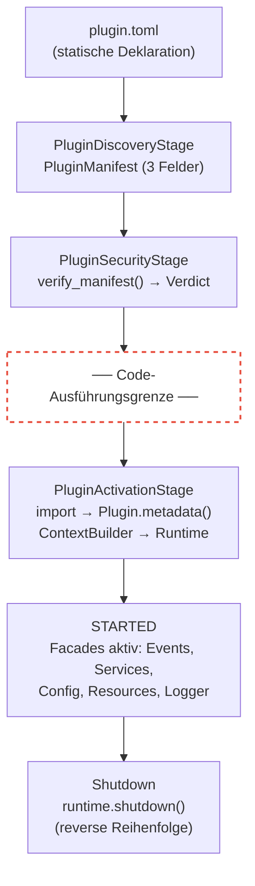
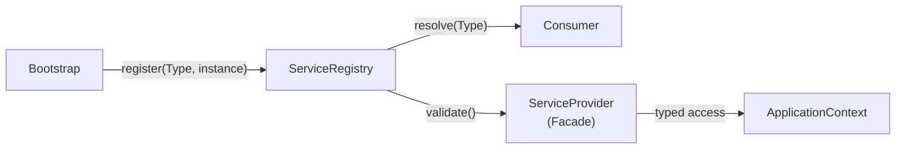
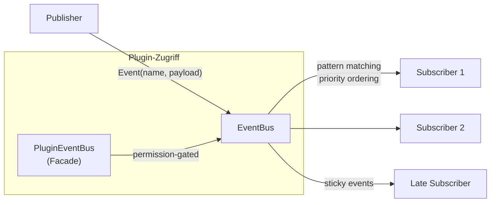
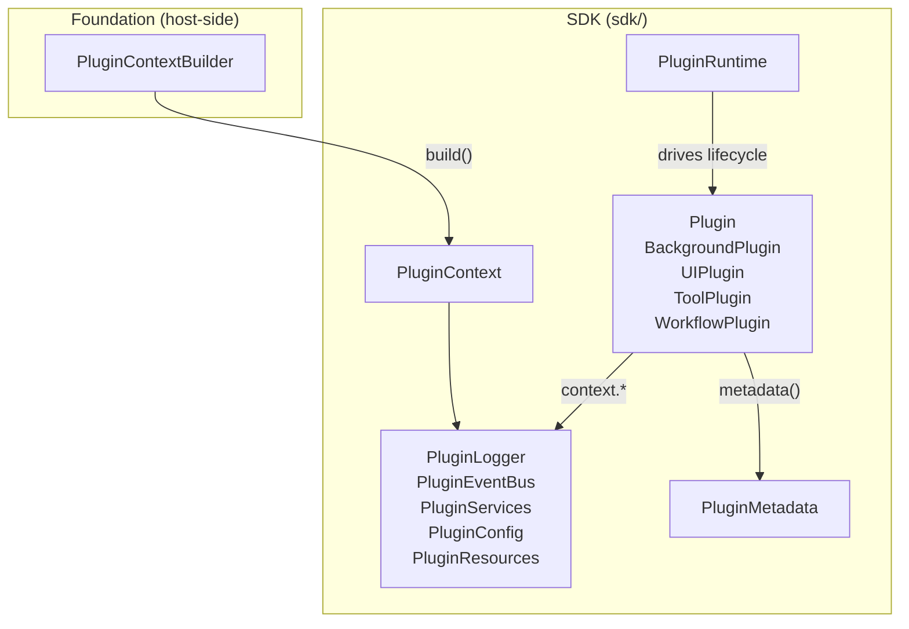
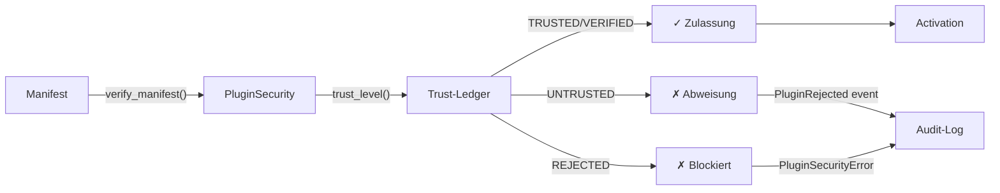
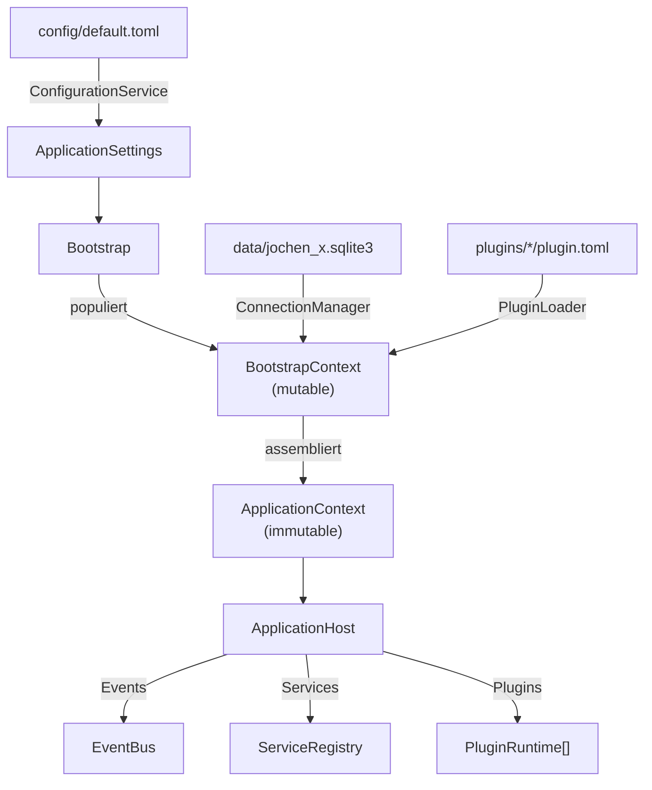

# JOCHEN X — Architekturübersicht

Diese Datei gibt einen visuellen Überblick über die Gesamtarchitektur.

**Verbindliche Architekturreferenz:** [Architecture Book v2.0](docs/architecture-book-v2.md) (APPROVED / FROZEN).  
Inhaltliche Abweichungen erfordern eine neue Book-Version und dokumentierte ADRs.  
Für Einzelentscheidungen siehe zusätzlich die [ADRs](docs/adr/).

---

## Schichtenarchitektur

Abhängigkeiten zeigen ausschließlich nach innen. Keine äußere Schicht wird von einer inneren importiert.

**Referenz:** [ADR-001](docs/adr/001-core-boundaries.md) (Core-Grenzen), [ADR-003](docs/adr/003-optional-developer-platform.md) (Developer opt-in)

---

## Bootstrap-Lifecycle

`ApplicationHost` startet die Anwendung über `BootstrapManager` in vier deterministischen Phasen.

Jede Stage ist ein isoliertes `BootstrapStage`-Objekt, das den gemeinsamen `BootstrapContext` populiert. Nach Abschluss wird der immutable `ApplicationContext` assembliert.

**Referenz:** [docs/architecture.md](docs/architecture.md) (Stage-Tabelle), [ADR-011](docs/adr/011-sdk-host-integration.md) (PluginSecurity/ActivationStage)

---

## Plugin-Lifecycle

Vom Dateisystem bis zum laufenden Plugin durchläuft ein Plugin fünf Phasen. Die Code-Ausführungsgrenze liegt zwischen Security und Activation.

**Kein Plugin-Code vor der Sicherheitsprüfung.** Discovery liest nur TOML. Security prüft den Trust-Ledger. Erst nach Zulassung wird Python-Code importiert.

**Referenz:** [ADR-001](docs/adr/001-core-boundaries.md) (kein Code-Import), [ADR-010](docs/adr/010-plugin-sdk-architecture.md) (SDK), [ADR-011](docs/adr/011-sdk-host-integration.md) (Integration)

---

## ServiceRegistry

Einziger Kompositionsmechanismus. Alle Services werden während Bootstrap registriert und über typisierte Schlüssel aufgelöst.

Plugins erhalten keinen direkten Zugriff auf die `ServiceRegistry`. Stattdessen nutzen sie `PluginServices` — eine eingeschränkte Facade, die nur freigegebene Service-Typen exponiert.

---

## Event-System

Thread-safe, typed, synchron und asynchron. Alle Kommunikation zwischen Schichten läuft über Events.

| Feature | Beschreibung |
|---|---|
| Typed Events | `ApplicationEvent`-Subklassen mit `EVENT_NAME` und `_payload()` |
| Glob-Patterns | Subscriber können Wildcards verwenden (`application.*`) |
| Sticky Events | Werden an späte Subscriber nachgeliefert |
| Prioritäten | Höhere Priorität wird zuerst bedient |
| Async | `publish_async()` für nicht-blockierende Delivery |

**Referenz:** [ADR-002](docs/adr/002-event-delivery.md) (Delivery-Semantik), [docs/events.md](docs/events.md)

---

## SDK

Das Plugin SDK (`sdk/`) ist die einzige öffentliche API für Plugin-Autoren. Plugins importieren nie aus `core`, `app`, `plugins`, `services` oder `ui`.

**Referenz:** [ADR-010](docs/adr/010-plugin-sdk-architecture.md) (SDK-Architektur), [docs/sdk.md](docs/sdk.md) (Spezifikation)

---

## Sicherheitsmodell

Zero-Trust-Prinzip: kein Plugin wird ohne explizite Zulassung aktiviert.

| Komponente | Verantwortung |
|---|---|
| `PluginSecurity` | Trust-Ledger, Manifest-Verifizierung |
| `SecretVault` | Sichere Speicherung sensibler Werte |
| `PermissionManager` | Capability-basierte Zugriffssteuerung |
| `AuditLogger` | Sicherheitsrelevante Ereignisse protokollieren |
| `ThreatDetector` | Erkennung verdächtiger Muster |

**Referenz:** [docs/security.md](docs/security.md), [ADR-004](docs/adr/004-plugin-security-integration.md) (Security-Timing), [ADR-011](docs/adr/011-sdk-host-integration.md) §D3

---

## Datenfluss

Vom Start bis zur laufenden Anwendung:

---

## Komponentenübersicht

| Komponente | Modul | Verantwortung |
|---|---|---|
| `ApplicationHost` | `app/application_host.py` | Lifecycle-Eigentümer, Start/Shutdown |
| `BootstrapManager` | `app/bootstrap.py` | Deterministische Stage-Ausführung |
| `ApplicationContext` | `app/context.py` | Immutables Aggregat aller Services |
| `ServiceRegistry` | `core/registry.py` | Typisierte Service-Registrierung |
| `EventBus` | `core/events.py` | Thread-safe Event-Distribution |
| `VersionManager` | `core/version.py` | Semver-Kompatibilitätsprüfung |
| `PluginLoader` | `plugins/loader.py` | TOML-only Manifest-Discovery |
| `PluginSecurity` | `app/security/plugin_security.py` | Trust-Validierung |
| `PluginRuntime` | `sdk/plugin.py` | Plugin-Lifecycle-Steuerung |
| `PluginContext` | `sdk/context.py` | Plugin-scoped Runtime-Aggregat |
| `DeveloperPlatform` | `developer/platform.py` | Opt-in Diagnostics und Inspection |
| `MainWindow` | `ui/navigation/main_window.py` | PySide6-Hauptfenster |

---

## ADR-Verzeichnis

| ADR | Thema | Status |
|---|---|---|
| [001](docs/adr/001-core-boundaries.md) | Core-Grenzen | Akzeptiert |
| [002](docs/adr/002-event-delivery.md) | Event-Delivery | Akzeptiert |
| [003](docs/adr/003-optional-developer-platform.md) | Developer Platform opt-in | Akzeptiert |
| [004](docs/adr/004-plugin-security-integration.md) | Security-Timing | Resolved (ADR-011) |
| [005](docs/adr/005-plugin-integrity-validation.md) | Integrity-Validation | Offen |
| [006](docs/adr/006-plugin-permission-model.md) | Permission-Model | Offen |
| [007](docs/adr/007-plugin-dependency-resolution.md) | Dependency-Resolution | Offen |
| [008](docs/adr/008-plugin-context-definition.md) | Plugin-Context | Resolved (ADR-010/011) |
| [009](docs/adr/009-plugin-isolation-strategy.md) | Isolation-Strategy | Resolved (ADR-011) |
| [010](docs/adr/010-plugin-sdk-architecture.md) | SDK-Architektur | Akzeptiert |
| [011](docs/adr/011-sdk-host-integration.md) | SDK-Host-Integration | Akzeptiert |
